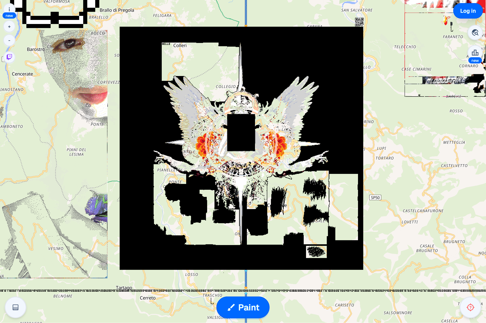
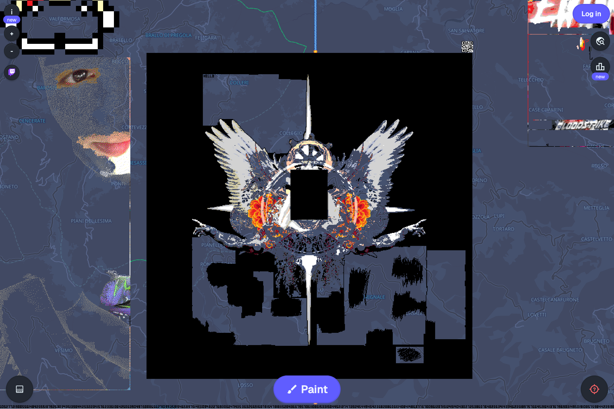

# Auto Dark Theme for WPlace

A lightweight browser extension that automatically forces the dark theme on wplace.live and keeps it in sync with your browser’s color scheme.

---

## Features

- 🌙 Forces dark mode on wplace.live
- 🔄 Syncs with your system/browser theme (auto-switch)
- ⚡️ Super fast and minimal
- 🛡️ No data collection, no ads, open source

---

## Installation

After downloading or cloning this repository, you must use the `wplace-darkmode` folder to install the extension.

### Chrome
1. Download or clone this repository.
2. Copy the folder `wplace-darkmode` to a location of your choice.
3. Go to `chrome://extensions/` in your browser.
4. Enable **Developer mode** (top right).
5. Click **Load unpacked** and select the `wplace-darkmode` folder.

### Firefox
1. Download or clone this repository.
2. Copy the folder `wplace-darkmode` to a location of your choice.
3. Go to `about:debugging#/runtime/this-firefox`.
4. Click **Load Temporary Add-on** and select the `manifest.json` file inside the `wplace-darkmode` folder.

---

## How it works
- The extension injects a script that sets the dark theme on wplace.live.
- It listens for changes in your system/browser theme and updates the site automatically.

---

## Author
- **Enea**  
  [GitHub](https://github.com/Frenxys)

---

## License
MIT

---

## Screenshots

### Before

### After

---

## Contributing
Pull requests and suggestions are welcome!

---

---

## Support
For issues or feature requests, open an issue on [GitHub](https://github.com/Frenxys).
